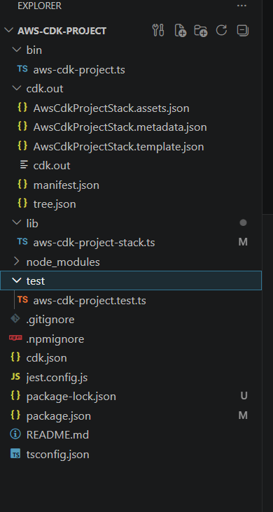
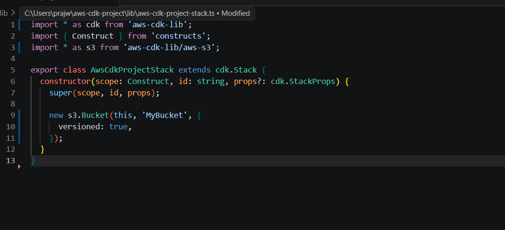
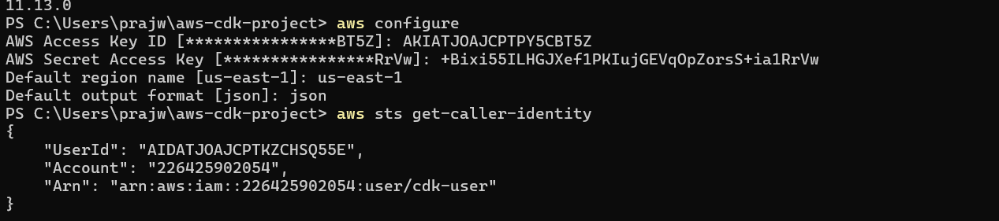
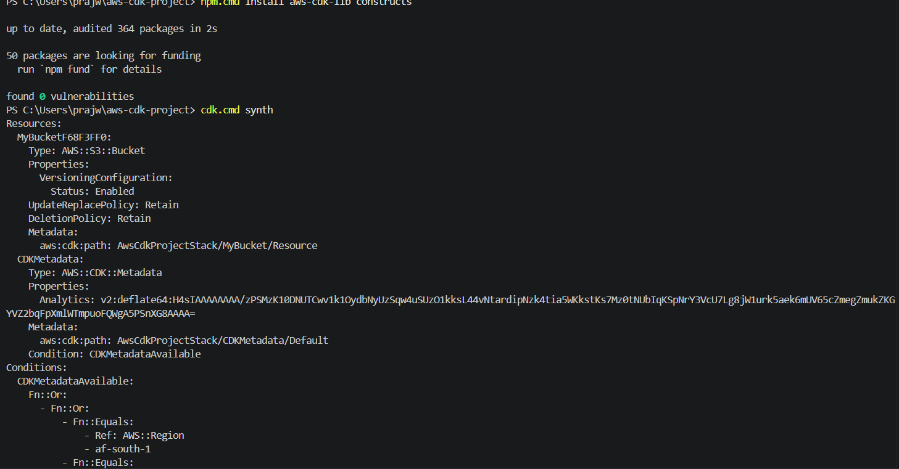
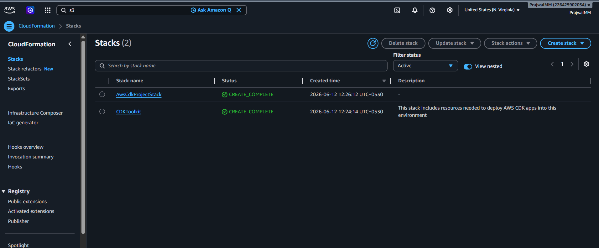
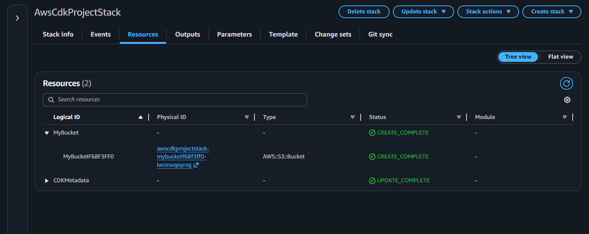
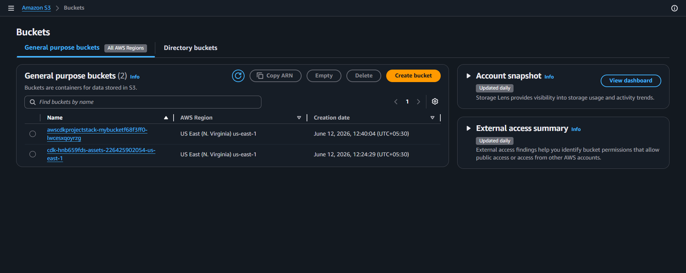
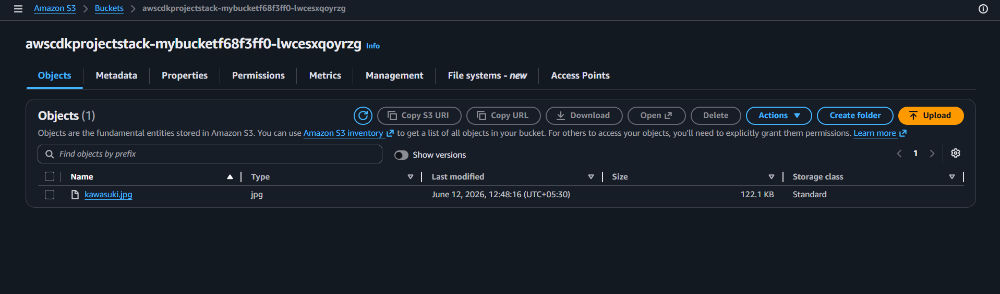

# Infrastructure as Code using AWS CDK

## Project Overview

This project demonstrates Infrastructure as Code (IaC) using AWS CDK and AWS CloudFormation.

The infrastructure is defined in TypeScript and deployed automatically to AWS.

## Architecture

AWS CDK
↓
CloudFormation
↓
Amazon S3 Bucket

## Technologies Used

- AWS CDK
- AWS CloudFormation
- Amazon S3
- AWS CLI
- TypeScript
- IAM

## Features

- Infrastructure as Code
- Automated deployment
- CloudFormation stack creation
- S3 bucket provisioning
- Versioned storage

## Deployment Commands

```bash
cdk synth
cdk deploy
```

## Resources Created

- Amazon S3 Bucket
- CDK Metadata

## Screenshots

See the screenshots folder.

## Learning Outcomes

- Infrastructure as Code
- AWS CDK
- CloudFormation
- Resource Automation
- Cloud Resource Management

# Screenshots

















## Project Summary

This project demonstrates Infrastructure as Code (IaC) using AWS CDK and AWS CloudFormation. The infrastructure was defined in TypeScript and deployed automatically to AWS using the AWS CLI. Through this project, an Amazon S3 bucket was provisioned and managed without manual resource creation in the AWS Console. The project showcases cloud automation, resource provisioning, infrastructure management, and modern DevOps practices while utilizing AWS Free Tier services. This implementation helped in understanding AWS CDK, CloudFormation stacks, IAM authentication, deployment workflows, and the benefits of managing cloud infrastructure through code.